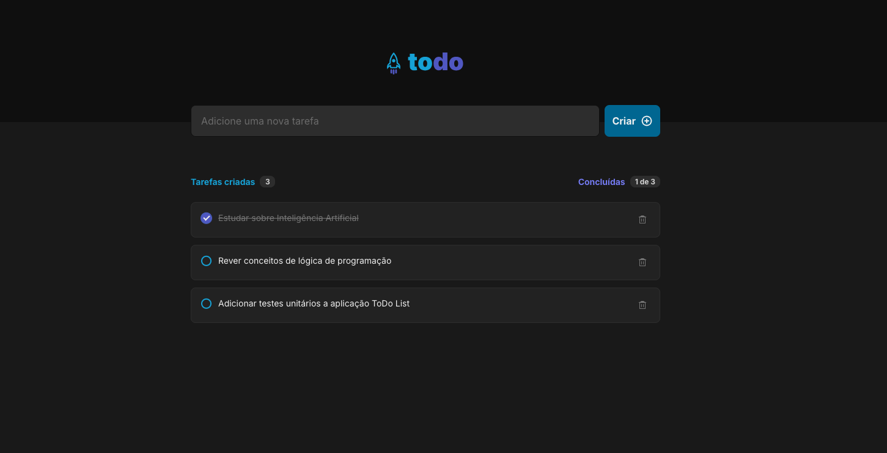

# ToDo List




## Description

**ToDo List** is a simple and modern task management application, built with TypeScript and ReactJS as part of a Rocketseat course. The project's goal is to practice fundamental React concepts such as components, states, and list manipulation.

The app allows users to:

- Add new tasks to your list
- Mark tasks as completed or pending
- Remove tasks
- Edit tasks already created on the list
- Drag and drop the task to change its order
- View your daily activities progress

## Features

- 💡 Clean and intuitive interface
- 📝 Easily add, edit, complete and remove tasks
- 📊 View total created and completed tasks
- 🔄 Real-time task list updates
- 🖱️ Drag & drop to reorder your tasks
- 🎨 Modern styling with SASS and Google Fonts

## Technologies

- [Vite](https://vitejs.dev/)
- [ReactJS](https://react.dev/learn)
- [TypeScript](https://www.typescriptlang.org/)
- [SASS](https://sass-lang.com/)
- [Google Fonts](https://fonts.google.com/)

## Getting Started

### Prerequisites

- Node.js v19 or higher

### Installation

```bash
git clone https://github.com/pamelasantoss/ignite-todo-list.git
cd ignite-todo-list
npm install
npm run dev
```

Visit [http://localhost:5173](http://localhost:5173) to view the app.

### Production Build

```bash
npm run build
npm run preview
```

## Project Structure

- `src/assets`: Contains project images and icons
- `src/components`: Reusable interface components (e.g., Task, Toast, Header)
- `src/styles`: Global styling and SASS variables

## Learning Goals

This project was developed to practice and demonstrate:

- List manipulation and state management in React
- Component-based architecture and code organization best practices
- Static typing and safety with TypeScript
- Modern styling with SASS
- Simple and efficient user experience

## Contributing

Contributions are welcome! Feel free to open issues or submit pull requests.

## License

This project is under the MIT license. See the [LICENSE](https://github.com/pamelasantoss/ignite-todo-list/blob/main/LICENSE) file for details.

---

Made with ❤️ by [Pamela Santos](https://pamelasantos.dev.br/)
